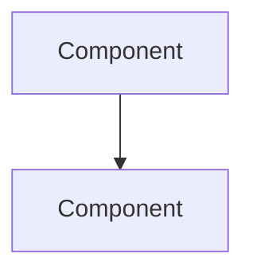

# Log-Blog: Browser History → Tech Blog Post

You are orchestrating a pipeline that turns the user's Chrome browsing history into a deep-dive technical journal on their Hugo blog.

**Project root**: The directory where you are running Claude Code (this repo).
**Blog repo**: Configured in `config.yaml` → `blog.repo_path`.

---

## First-Run Setup

Check if setup is needed. If `uv run log-blog extract --help` fails, run:

```bash
uv sync && uv run playwright install chromium
```

If `config.yaml` doesn't exist:
```bash
cp config.example.yaml config.yaml
```
Then remind the user to edit `config.yaml` and set their `blog.repo_path` and `blog.repo_url`.

---

## Step 1: Extract History

```bash
uv run log-blog extract --json --hours 24
```

Adjust `--hours` if the user specifies a different range. This outputs a JSON array of `{url, title, visit_count, last_visit_time}`.

---

## Step 2: Classify and Group (You — Claude — Do This)

Read the JSON output and split entries into **tech** vs **non-tech**.

**Tech** = programming docs, GitHub repos/issues/PRs, Stack Overflow, dev blogs, API docs, framework docs, tech news (HN, etc.), cloud platform pages, tutorials, YouTube tech talks.

**Non-tech** = social media, shopping, banking, email, entertainment, generic search result pages.

**Group classified entries by URL type:**
- **YouTube** — video URLs (youtube.com, youtu.be)
- **GitHub** — repos, PRs, issues
- **Docs/Web** — documentation sites, blog posts, other web pages

This grouping helps you plan the blog post structure and prioritize which entries deserve deep analysis.

---

## Step 3: Present to User for Approval

Show the user a numbered list, grouped by type:

**YouTube:**
1. [Title](url)

**GitHub:**
2. [Title](url)

**Docs/Web:**
3. [Title](url)

**Filtered out:**
- [Title](url)

Ask: *"Want to add/remove any entries before I fetch content?"*

**Wait for explicit approval before proceeding.**

---

## Step 4: Fetch Enriched Content

Take the approved URLs and run:

```bash
uv run log-blog fetch --json "URL1" "URL2" "URL3"
```

The `fetch` command returns enriched data based on URL type:
- **YouTube**: Full transcript text (Korean preferred, then English)
- **GitHub repos**: Description, stars, languages, README content, recent commits
- **GitHub PRs**: Title, state, body, diff stats (+/-/files), comments
- **GitHub issues**: Title, state, labels, body, comments
- **Web pages**: Full text with headings hierarchy and code blocks

Each result includes `url_type` and `metadata` fields with structured data.

**For deeper GitHub analysis**, you can run additional `gh` CLI commands:
```bash
# View full PR diff
gh pr diff 123 --repo owner/repo

# View repo file tree
gh api repos/owner/repo/git/trees/main --jq '.tree[].path'

# View specific file content
gh api repos/owner/repo/contents/path/to/file --jq '.content' | base64 -d
```

Note any fetch failures — skip them gracefully.

---

## Step 5: Write the Blog Post (You — Claude — Do This)

Using the fetched content, write a Hugo markdown post. This should be a **deep-dive technical journal**, not a link diary.

### Post Structure

```markdown
---
title: "Tech Log: YYYY-MM-DD"
date: YYYY-MM-DD
categories: ["tech-log"]
tags: ["extracted", "from", "content"]
toc: true
math: false
---

## Overview
Brief 2-3 sentence summary of the day's exploration theme.

## [Descriptive Topic Name]
(Each major topic gets its own ## section — use descriptive names, not "Highlights")

2-4 paragraphs of real technical analysis per topic...

## [Another Topic Name]
...

## Quick Links
Remaining entries as a bullet list:
- [Title](url) — One-line description

## Insights
5-8 sentence reflection connecting the topics explored, identifying patterns, and noting potential applications.
```

### Writing Guidelines by URL Type

**YouTube videos:**
- Summarize the speaker's key arguments and technical points from the transcript
- Quote notable statements (translate to post language if needed)
- Highlight specific techniques, tools, or concepts discussed
- Note timestamps for key sections if the transcript reveals structure

**GitHub repositories:**
- Analyze the architecture based on README, languages, and file structure
- Highlight interesting design patterns or technical decisions
- Mention the tech stack and how components fit together
- Note star count and community activity as context

**GitHub PRs:**
- Explain the problem being solved and the approach taken
- Summarize the diff: what changed, what was added/removed
- Note interesting discussion points from comments
- Highlight any code patterns worth learning from

**GitHub issues:**
- Explain the bug or feature request and its significance
- Summarize the discussion and any proposed solutions
- Note how it relates to the broader project

**Docs / Web pages:**
- Extract and explain key concepts
- Highlight code examples with context
- Explain how this fits into the broader ecosystem

### Enrichment Features

**Mermaid diagrams**: Include when architecture or data flow is discussed. The blog supports mermaid code blocks:
````markdown

````

**Code snippets**: Include relevant code from fetched content (GitHub READMEs, PR diffs, docs examples).

### Quality Rules

- Tags = actual technologies (e.g., "python", "hugo", "playwright"), not generic words
- Each ## section should have a descriptive name reflecting the topic, not generic headers
- Every major topic gets 2-4 paragraphs of substantive analysis
- Include specific details: function names, config options, version numbers
- Highlight connections between different topics explored
- Default language: Korean. Use English only if user's browsing was primarily English.
- For Korean posts, use Korean section headers and body text, but keep code/technical terms in English

---

## Step 6: User Reviews the Post

Show the complete generated markdown to the user. Ask:

*"Here's the draft post. Want me to change anything before publishing?"*

Apply any edits the user requests. Repeat until they approve.

---

## Step 7: Publish

Once the user approves the post, save it to a file and publish:

```bash
# Write the post to a temp file
cat > /tmp/log-blog-post.md << 'POSTEOF'
(paste the full markdown content here)
POSTEOF

# Publish (commit to blog repo, no push yet)
uv run log-blog publish /tmp/log-blog-post.md
```

Then ask the user: *"Post committed locally. Push to GitHub to deploy?"*

If yes, get the blog repo path from `config.yaml` and run:
```bash
git -C "$(uv run python -c "from log_blog.config import load_config; c = load_config(); print(c.blog.repo_path_resolved)")" push
```

---

## Tips

- If fewer than 3 tech entries, suggest expanding `--hours`
- If fetching fails for some URLs, skip them and note it
- The user may want a specific angle or theme — ask before writing if the topics are diverse
- For Korean posts, use Korean section headers: 개요, 빠른 링크, 인사이트
- Use Mermaid diagrams for any topic involving architecture, pipelines, or data flow
- For GitHub repos, consider running extra `gh` commands to get file trees or specific files for deeper analysis
