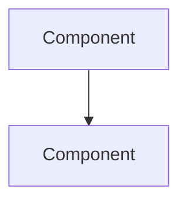

# Log-Blog: Browser History → Tech Blog Post

You are orchestrating a pipeline that turns the user's Chrome browsing history into a deep-dive technical journal on their Hugo blog.

**Project root**: The directory where you are running Claude Code (this repo).
**Blog repo**: Configured in `config.yaml` → `blog.repo_path`.

---

## First-Run Setup

Check if setup is needed. If `uv run log-blog extract --help` fails, run:

```bash
uv sync && uv run playwright install chromium
```

If `config.yaml` doesn't exist:
```bash
cp config.example.yaml config.yaml
```
Then remind the user to edit `config.yaml` and set their `blog.repo_path` and `blog.repo_url`.

---

## Step 1: Extract History & Sessions

Run both commands simultaneously:

```bash
uv run log-blog extract --json --since-last-run
```

```bash
uv run log-blog sessions --list --since-last-run
```

Adjust `--hours N` if the user specifies a different range. The `--since-last-run` flag automatically calculates the time window from the last run. On first run, it falls back to the default 24 hours.

The `extract` command outputs a JSON array of `{url, title, visit_count, last_visit_time, url_type}`.
The `sessions --list` command shows a table of projects with session counts, commit counts, and duration.

---

## Step 2: Classify and Group (You — Claude — Do This)

Read the JSON output. Each entry now includes a `url_type` field from the classifier.

**Use `url_type` for grouping** — don't reclassify manually:
- `youtube` → YouTube
- `github_repo`, `github_pr`, `github_issue` → GitHub
- `ai_chat_perplexity`, `ai_chat_chatgpt`, `ai_chat_claude`, `ai_chat_gemini` → AI Chats
- `docs_page`, `web_page` → Docs/Web
- `ai_landing` entries are already filtered out by default

**Filter out non-tech** entries (social media, shopping, banking, etc.) based on URL and title.

**Group classified entries by URL type:**
- **YouTube** — video URLs (youtube.com, youtu.be)
- **GitHub** — repos, PRs, issues
- **AI Chats** — ChatGPT, Claude, Gemini, Perplexity conversations
- **Docs/Web** — documentation sites, blog posts, other web pages

This grouping helps you plan the blog post structure and prioritize which entries deserve deep analysis.

### Session-Based Projects

For each project from `sessions --list` output, determine its dev log status:

1. Check scan results (from Step 2.5) for existing series: posts where `series` field matches the project name
2. If series exists:
   - `next_num = highest series_num + 1`
   - Note `prev_last_commit` and `prev_date` for commit filtering in Step 4
3. If no series exists: `series_num = 1` (new series)
4. Projects with zero sessions or only trivial activity can be skipped

---

## Step 2.5: Scan Existing Posts (You — Claude — Do This)

Before presenting to the user, scan existing blog posts so you can recommend the right post action:

```bash
uv run log-blog scan --json --limit 30
```

This returns an array of `{filename, path, title, date, tags, categories, content_preview}` for the most recent posts.

**Compare today's classified tech URLs (their topics/technologies) against existing posts:**

### Decide one of three actions:

**`new`** — Default. Create a fresh post dated today.
- Conditions: No existing post covers the same primary topics, or the most recent related post is older than 14 days.

**`sequential`** — Today's content continues an ongoing series started within the past 14 days.
- Detection: Existing post(s) with heavily overlapping tags AND the current session covers the same domain (e.g., multiple days of GitHub commit activity, or a multi-day deep-dive into one framework).
- Numbering: Find the highest existing day number and increment. Title format: `"Tech Log: YYYY-MM-DD (Day N)"` / `"기술 로그: YYYY-MM-DD (N일차)"`.
- In the Overview section, add a brief "이전 글 / Previous Post" link to the most recent related post.

**`update`** — Today's content meaningfully extends a post from the past 7 days.
- Conditions: A recent post covers the **exact same primary topic**, and the new content adds new sections, corrections, or substantial updates (not just more links on loosely related topics).
- Read the existing post using `cat {post.path}` to understand what's already there.
- Extend or revise it rather than duplicating covered material.
- When publishing: use `--filename` to write to the same file and add `--update` flag.

**Surface this decision in Step 3** — tell the user your recommendation and reasoning before asking for approval.

---

## Step 3: Present to User for Approval

Show the user a numbered list, grouped by type:

**YouTube:**
1. [Title](url)

**GitHub:**
2. [Title](url)

**Docs/Web:**
3. [Title](url) `[shallow]`
4. [Title](url) `[shallow]`

*Any docs entries you want me to deep-fetch? Deep mode crawls related sub-pages via Firecrawl for guide-style coverage. Just give me the numbers (e.g., "3, 4") or "none".*

**Filtered out:**
- [Title](url)

Also state your **post action recommendation** from Step 2.5:

> **Post action**: `new` / `sequential (Day N)` / `update (existing-filename.md)`
> *Reason: [one sentence explanation]*

Ask: *"Want to add/remove any entries, or change the post action before I fetch content?"*

**Wait for explicit approval before proceeding.**

**코드 기반 dev log 후보:**
- **project-a** (N sessions, M commits, Xh Ym) — Type — **#K** (continues from #K-1, N new commits)
- **project-b** (N sessions, M commits, Xh Ym) — Type — **new series #1**
- **project-c** — **already up to date** (0 new commits since #K)

Also state your post action recommendations for both browser-based and dev log posts together.

After approval:
- Browser-based items proceed to Step 4 (fetch content)
- Dev log items proceed to Dev Log Mode Step 3 (get detailed session data with `sessions --project <name> --all --json`)
- Both types can be written in parallel

If the user frequently uses Claude.ai web chat or Claude Code, suggest:
> "To include Claude conversations, export your data from claude.ai → Settings → Export, then run `uv run log-blog import-ai ~/path/to/claude-export.json`."

---

## Step 4: Fetch Enriched Content

Take the approved URLs and run:

```bash
uv run log-blog fetch --json "URL1" "URL2" "URL3"
```

### Deep docs fetching

For URLs the user selected for deep fetching, use the `--deep` flag:

```bash
uv run log-blog fetch --json --deep "DOCS_URL1" "DOCS_URL2"
```

Run shallow and deep fetches as separate commands — `--deep` applies to all URLs in that invocation. Combine the results.

Deep-fetched docs return `metadata.source = "firecrawl"` and `metadata.pages_crawled` showing how many sub-pages were crawled. The `text_content` contains combined markdown from all crawled pages, separated by page headers.

If Firecrawl is not configured (no API key), the command falls back to single-page Playwright fetch automatically.

### AI chat content — two paths

**Online path** (automatic when `accounts.ai_chats.{service}.auth_profile` is set in config.yaml):
Perplexity search, ChatGPT (chatgpt.com + legacy chat.openai.com), Claude.ai, and Gemini (gemini.google.com) chat URLs are auto-detected in history and fetched via Chrome DevTools Protocol (CDP). Pass them to `fetch` normally — no extra steps.

**Prerequisite**: Chrome must be running with remote debugging enabled. Chrome v130+ requires a non-default `--user-data-dir` for CDP, so launch it with a copy of the real profile:

```bash
uv run log-blog chrome-cdp
```

This copies essential profile files (Cookies, Login Data, etc.) to a temp directory and launches Chrome with `--remote-debugging-port=9222`. The user's auth sessions are preserved because Chrome decrypts the copied cookies via Keychain.

The CDP port is configured in `config.yaml` → `playwright.cdp_port` (default: 9222). When Chrome is running with this flag, Playwright connects to the live browser session — no manual Keychain password entry needed.

Each service is configured independently:
```yaml
playwright:
  cdp_port: 9222  # Must match --remote-debugging-port

accounts:
  ai_chats:
    perplexity:
      auth_profile: "your-google-email@gmail.com"  # Label for the Chrome account logged into perplexity.ai
      enabled: true
    chatgpt:
      auth_profile: "your-google-email@gmail.com"  # Label for the Chrome account logged into chatgpt.com
      enabled: true
    claude:
      auth_profile: "your-work-email@company.com"  # Label for the Chrome account logged into claude.ai
      enabled: true
    gemini:
      auth_profile: "your-google-email@gmail.com"  # Label for the Chrome account logged into gemini.google.com
      enabled: true
```
Leave `auth_profile` empty to fall back to unauthenticated Playwright (will hit login wall). Set `enabled: false` to skip a service entirely. If CDP connection fails (Chrome not running with the flag), it automatically falls back to a headless browser.

**Offline path** (manual, when auth_profile is not configured or export is preferred):
```bash
uv run log-blog import-ai ~/Downloads/conversations.json --json --days 7
# or for Gemini Takeout directory:
uv run log-blog import-ai ~/Downloads/Takeout/ --json --days 7
```
Output matches `fetch --json` schema. Include it alongside fetch results when writing the post.
Export instructions: ChatGPT → Settings → Data Controls → Export | Claude → Settings → Export data | Gemini → takeout.google.com

The `fetch` command returns enriched data based on URL type:
- **YouTube**: Full transcript text (Korean preferred, then English)
- **GitHub repos**: Description, stars, languages, README content, recent commits
- **GitHub PRs**: Title, state, body, diff stats (+/-/files), comments
- **GitHub issues**: Title, state, labels, body, comments
- **Bitbucket repos**: Description, language, README content (uses App Password from `config.yaml` if configured)
- **Bitbucket PRs**: Title, state, author, source/destination branch, description
- **AI chats (online)**: `url_type` = `ai_chat_perplexity` / `ai_chat_chatgpt` / `ai_chat_claude` / `ai_chat_gemini`, `metadata.source` = `"online"`, conversation Q&A transcript
- **AI chats (offline)**: `url_type` = `ai_chat_export`, `metadata.source` = `"offline"`, `metadata.service` = `"chatgpt"` / `"claude"` / `"gemini"`
- **Web pages**: Full text with headings hierarchy and code blocks

Each result includes `url_type` and `metadata` fields with structured data.

**For deeper GitHub analysis**, you can run additional `gh` CLI commands:
```bash
# View full PR diff
gh pr diff 123 --repo owner/repo

# View repo file tree
gh api repos/owner/repo/git/trees/main --jq '.tree[].path'

# View specific file content
gh api repos/owner/repo/contents/path/to/file --jq '.content' | base64 -d
```

Note any fetch failures — skip them gracefully.

---

## Step 5: Write the Blog Post (You — Claude — Do This)

Using the fetched content, write a Hugo markdown post. This should be a **deep-dive technical journal**, not a link diary.

### Post Structure

```markdown
---
image: "/images/posts/YYYY-MM-DD-tech-log/cover.jpg"
title: "Tech Log: YYYY-MM-DD"
description: "One-sentence plain-text summary for SEO and og:description (NO quotes, NO special chars)"
date: YYYY-MM-DD
categories: ["tech-log"]
tags: ["extracted", "from", "content"]
toc: true
math: false
---

## Overview
Brief 2-3 sentence summary of the day's exploration theme.

<!--more-->

## [Descriptive Topic Name]
(Each major topic gets its own ## section — use descriptive names, not "Highlights")

2-4 paragraphs of real technical analysis per topic...

## [Another Topic Name]
...

## Quick Links
Remaining entries as a bullet list:
- [Title](url) — One-line description

## Insights
5-8 sentence reflection connecting the topics explored, identifying patterns, and noting potential applications.
```

### Writing Guidelines by URL Type

**YouTube videos:**
- Summarize the speaker's key arguments and technical points from the transcript
- Quote notable statements (translate to post language if needed)
- Highlight specific techniques, tools, or concepts discussed
- Note timestamps for key sections if the transcript reveals structure

**GitHub repositories:**
- Analyze the architecture based on README, languages, and file structure
- Highlight interesting design patterns or technical decisions
- Mention the tech stack and how components fit together
- Note star count and community activity as context

**GitHub PRs:**
- Explain the problem being solved and the approach taken
- Summarize the diff: what changed, what was added/removed
- Note interesting discussion points from comments
- Highlight any code patterns worth learning from

**GitHub issues:**
- Explain the bug or feature request and its significance
- Summarize the discussion and any proposed solutions
- Note how it relates to the broader project

**Bitbucket repos:**
- Analyze the README and language for architecture clues (same depth as GitHub repos)
- Note whether it's private — this signals internal/work tooling context
- If the README is sparse, note what the project likely does based on the name and description

**Bitbucket PRs:**
- Explain the problem being solved and the branch names (source → destination) for context
- Describe the changes from the PR description
- Note the state (OPEN / MERGED / DECLINED) and what that means for the project

**Docs / Web pages:**
- Extract and explain key concepts
- Highlight code examples with context
- Explain how this fits into the broader ecosystem

**Docs (deep-fetched via Firecrawl):**
- Synthesize all crawled pages into a cohesive guide section
- Structure as: Overview → Key Concepts → Code Examples → Gotchas/Tips
- Don't just summarize each page separately — weave them into a narrative
- Reference specific sub-pages when citing details
- Note the total pages crawled in the section intro (e.g., "Based on N pages from the official docs...")

### Enrichment Features

**Mermaid diagrams**: Every post MUST include at least one Mermaid diagram. Use the table below to decide which type fits each section. The blog supports mermaid code blocks.

**CRITICAL — Mermaid safety rules for Hugo Stack theme:**
1. **`description:` frontmatter is REQUIRED** — plain text, no quotes or special chars. Without it, Hugo auto-generates `og:description` from `.Summary`, which can include mermaid code and break the HTML meta tag (quotes in mermaid `A["text"]` break the `content="..."` attribute, leaking raw source onto the page).
2. **`<!--more-->` marker is REQUIRED** — place it after the Overview paragraph, BEFORE the first mermaid block. This limits `.Summary` to clean text only.
3. **Use `&lt;br/&gt;`** (HTML entities) instead of `<br/>` for line breaks in mermaid labels. Hugo's `safeHTML` converts `<br/>` to real HTML elements that break mermaid parsing.
4. **Always quote labels containing `/`** — use `["text with /slash"]` not `[text with /slash]`. Unquoted `/` triggers mermaid's rhombus syntax parser.
5. **One broken diagram hides ALL** — mermaid.js runs all diagrams in batch; if one fails, none become visible. Always validate syntax.
````markdown

````

| Content type | Diagram to include |
|---|---|
| GitHub / Bitbucket repo | `graph TD` — architecture: main components and how they connect |
| GitHub / Bitbucket PR | `graph LR` — before → after: what the change replaced |
| YouTube tech talk | `flowchart TD` — the speaker's main argument or concept flow |
| AI chat (Perplexity / ChatGPT / Claude / Gemini) | `graph TD` — the question chain or reasoning flow explored |
| Docs / tutorial | `graph TD` — the concept hierarchy or step-by-step process |
| Multiple topics | `graph TD` — a "Today's Exploration Map" overview at the top of the post |

If a section genuinely cannot support a diagram (e.g., a single link with no structure), skip it — but at minimum the Overview or Insights section must have a summary diagram.

**Code snippets**: Include relevant code from fetched content (GitHub READMEs, PR diffs, docs examples).

### Quality Rules

- Tags = actual technologies (e.g., "python", "hugo", "playwright"), not generic words
- Each ## section should have a descriptive name reflecting the topic, not generic headers
- Every major topic gets 2-4 paragraphs of substantive analysis
- Include specific details: function names, config options, version numbers
- Highlight connections between different topics explored
- Default language: Korean. Use English only if user's browsing was primarily English.
- For Korean posts, use Korean section headers and body text, but keep code/technical terms in English

---

## Step 6: User Reviews the Post

Show the complete generated markdown to the user. Ask:

*"Here's the draft post. Want me to change anything before publishing?"*

Apply any edits the user requests. Repeat until they approve.

---

## Step 7: Publish

Once the user approves the post, save it to a file and publish using the action decided in Step 2.5:

```bash
# Write the post to a temp file
cat > /tmp/log-blog-post.md << 'POSTEOF'
(paste the full markdown content here)
POSTEOF
```

**For `new` or `sequential`** — publish with the new date-based filename, including image flags:
```bash
uv run log-blog publish /tmp/log-blog-post.md --cover-title "Post Title Here" --tags "tag1,tag2,tag3"
# For sequential, override the title via --filename if needed:
# uv run log-blog publish /tmp/log-blog-post.md --filename 2026-02-20-tech-log.md --cover-title "Post Title" --tags "tag1,tag2"
```

**For `update`** — overwrite the existing post file with the updated content:
```bash
uv run log-blog publish /tmp/log-blog-post.md --filename EXISTING-FILENAME.md --update --tags "tag1,tag2,tag3"
```
The `--update` flag changes the commit message to `"Update tech log: ..."`. Cover images are skipped if already present.

The publish command automatically:

- Generates a cover image with gradient, title, and tag pills using Pillow (if `--cover-title` is provided)
- Ensures SVG icons and `_index.md` files exist for each tag/category in the blog repo
- Includes all new image/taxonomy files in the git commit

Use `--no-images` to skip all image handling.

**Cover title tips:** Pass the post's title (it gets rendered on the generated cover image). The image colors are auto-selected based on the tags.

**Image frontmatter:** The `image:` field in frontmatter should be `/images/posts/{slug}/cover.jpg` where `{slug}` is the filename without `.md`. For example, filename `2026-02-24-tech-log.md` → `image: "/images/posts/2026-02-24-tech-log/cover.jpg"`.

Then ask the user: *"Post committed locally. Push to GitHub to deploy?"*

If yes, get the blog repo path from `config.yaml` and run:
```bash
git -C "$(uv run python -c "from log_blog.config import load_config; c = load_config(); print(c.blog.repo_path_resolved)")" push
```

---

## Tips

- If fewer than 3 tech entries, suggest expanding `--hours`
- If fetching fails for some URLs, skip them and note it
- The user may want a specific angle or theme — ask before writing if the topics are diverse
- For Korean posts, use Korean section headers: 개요, 빠른 링크, 인사이트
- Every post needs at least one Mermaid diagram — see the diagram table in Step 5 for which type fits each section
- For GitHub repos, consider running extra `gh` commands to get file trees or specific files for deeper analysis
- Always include `--cover-title` and `--tags` in the publish command so images and icons are handled automatically

---

## Dev Log Mode

When the user explicitly asks to "make a dev log" or "write a dev log from sessions", use this mode for the detailed writing steps. In the unified flow (above), dev log projects are already identified in Step 1 and presented in Step 3. This section covers Steps 3-5: fetching detailed data, writing, and publishing.

**If invoked standalone** (user asks only for dev logs, not the full pipeline): Run Step 1 of the main flow with `sessions --list --since-last-run` only (skip `extract`), then proceed to Step 3 presentation showing only dev log candidates.

### Step 1: List Projects

```bash
uv run log-blog sessions --list
```

Shows all Claude Code projects with sessions from the last 24 hours.

### Step 1.5: Detect Series Continuation

Run scan to find existing series posts:

```bash
uv run log-blog scan --json --limit 30
```

For each project from Step 1, check if a series already exists:

1. Filter scan results: posts where `series` field matches the project name
2. Sort matching posts by `series_num` DESC, take the highest
3. Record: `prev_series_num`, `prev_last_commit`, `prev_filename`, `prev_date`

**If previous series post found:**
- `next_num = prev_series_num + 1`
- When fetching session data in Step 3, filter commits:
  - Reverse `git_commits` to chronological order (sessions returns newest-first)
  - Find the commit where `sha.startswith(prev_last_commit)` (prefix match)
  - Include only commits AFTER that index
  - If `prev_last_commit` is not found (rebase/force push), fall back to date filtering:
    include commits with timestamp >= `prev_date + 1 day 00:00 KST`
  - If `prev_last_commit` is null but series exists, use the same date fallback
- If zero new commits after filtering → report "already up to date", skip this project
- Link to previous post: `[이전 글: #{prev_series_num}](/posts/{prev_filename without .md}/)`

**If no previous series post found:**
- `series_num = 1`
- Include all commits from sessions output

### Step 2: Present to User

Show which projects they worked on, with series status:

> "Today you worked on N projects:
> - **trading-agent** (22 sessions, 12 commits, 8h 15m) — GitHub — **#5** (continues from #4, 8 new commits)
> - **hybrid-search** (9 sessions, 5 commits, 3h 40m) — Bitbucket — **new series #1**
> - **log-blog** (4 sessions, 3 commits, 2h) — GitHub — **already up to date** (0 new commits since #2)
>
> Which ones should get dev log posts?"

Wait for user approval.

### Step 3: Get Detailed Data

For each approved project:

```bash
uv run log-blog sessions --project <name> --all --json
```

**JSON structure note:** The `sessions --project` output is a JSON list. Use the first element:

```
data = json.load(output)
project = data[0] if isinstance(data, list) else data
commits = project["git_commits"]
```

Each commit has these fields: `sha`, `message`, `timestamp` (ISO 8601), `files`, `insertions`, `deletions`.

**Commit filtering:** Use the `timestamp` field (not `date`) for time-based filtering:
- Series continuation: find the commit where `sha.startswith(prev_last_commit)`, include only commits after that index
- Date fallback: `c["timestamp"] >= "{prev_date}T00:00:00+09:00"` (KST)

Returns structured JSON with:
- **sessions**: conversation entries (user requests, code changes, errors, assistant responses)
- **git_commits**: actual commits with sha, message, files, insertions/deletions
- **files_changed**: all files touched across sessions

### Step 4: Write the Dev Log Post

Use the structured data to write a **narrative dev log** (problem → solution), not a topic overview.

**Template:**

```markdown
---
image: "/images/posts/YYYY-MM-DD-{slug}/cover.jpg"
title: "Series Title #N — Descriptive Subtitle"
description: Plain text summary for SEO
date: YYYY-MM-DD
series: "project-name"
series_num: N
last_commit: "abc1234"
categories: ["category"]
tags: ["tech1", "tech2"]
toc: true
math: false
---

## 개요
What was built/fixed today. Link to previous post if sequential.

<!--more-->

---

## [Problem/Feature Name]

### 배경
Why this work was needed (from user_request entries).

### 구현
What was done (from git commits + code_change entries).
Include actual code snippets from diffs.

### 문제 해결
Debugging narrative (from error entries):
"X를 시도 → Y 에러 → 원인: Z → 해결: ..."

---

## 커밋 로그

| 메시지 | 변경 |
|--------|------|
| feat: add feature | +120 -30 |

---

## 인사이트
Reflection connecting the day's work to broader patterns.
```

**Key rules:**
- Must include at least one Mermaid diagram (architecture change or data flow)
- Follow all mermaid safety rules (description, `<!--more-->`, `&lt;br/&gt;`, quote `/` labels)
- Include actual error messages and debugging steps from the session data
- Use code snippets from the actual diffs
- Default language: Korean
- Use `--filename "YYYY-MM-DD-{project-slug}.md"` to avoid collisions
- Never show git commit SHA/IDs in commit log tables — use message and changed files only

**Series frontmatter:** When writing the post, always set these fields:
- `series`: the project name (from `sessions --list`)
- `series_num`: the computed sequence number (from Step 1.5)
- `last_commit`: the short SHA (first 7 chars) of the newest commit in the post's git_commits

For sequential posts (#2+), add a link to the previous post in the 개요 section:
> [이전 글: #{prev_num} — {prev_title}](/posts/{prev_filename_without_md}/)

### Step 5: Publish

Same as the standard publish flow:

```bash
uv run log-blog publish /tmp/log-blog-post.md --filename "YYYY-MM-DD-{slug}.md" --cover-title "Post Title" --tags "tag1,tag2"
```

Series tracking is automatic via frontmatter fields (`series`, `series_num`, `last_commit`). The skill detects continuation in Step 1.5 — no manual checking needed.
