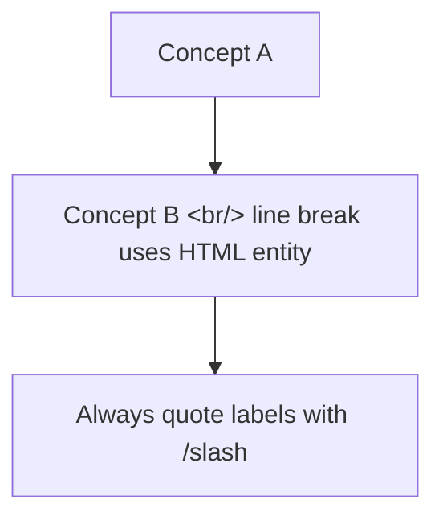

# Log-Blog: KakaoTalk Open Chat → Tech Blog Post

You are orchestrating a pipeline that turns URLs shared in **a user-selected subset** of KakaoTalk open chats — within the time window since the user's last blog post — into deep-dive technical posts on the user's Hugo blog. The flow mirrors `/logblog:post` (browser history → blog), but the source is open-chat link feeds and the discovery axis is the user's **post timeline** (not chat-local unread state, which clears whenever the user opens KakaoTalk on any device).

**Project root**: The directory where you are running Claude Code (the log-blog repo).
**Blog repo**: Configured in `config.yaml` → `blog.repo_path`.
**KakaoTalk source CLI**: `kakao-chat` from the [kakaotalk-chat-analyzer](https://github.com/ice-ice-bear/kakaotalk-chat-analyzer) repo (separate project). Default install path expected at `~/Documents/github/kakaotalk-chat-analyzer`. Requires `KAKAOCLI_KEY` env var; setup is documented there.

---

## ABSOLUTE RULES — Read first, do not violate

These are MANDATORY and apply to every output of this skill (drafts, mermaid labels, frontmatter, body, references, commit messages, file names, cover titles).

### Rule 1 — The chat source is invisible

The KakaoTalk open chat is the **data source**, not the subject of the post. **NEVER** mention any of:

- `KakaoTalk`, `카카오톡`, `kakao`
- `채팅방`, `오픈채팅`, `오픈 채팅방`
- `open chat`, `open chat room`, `chat thread`, `chat room`, `same chat`, `in a single chat`
- `chat_id`, `KakaoTalk chat`, `KakaoTalk chat thread`
- "한 사용자가 던진", "한 사람이 공유한", "30초 간격으로 던져진" (when "던져진/공유한" implies chat)
- Any link to `open.kakao.com` or framing like "in a chat" / "in the same room"

**Where to NOT mention them**: title, description (frontmatter), `## 개요`/`## Overview`, body paragraphs, mermaid diagram labels, table cells, `## 참고`/`## References` lists, commit messages, cover titles, file names.

**Approved neutral substitutions:**

| Forbidden phrasing | Use instead |
|---|---|
| "같은 채팅방에서 공유된" | "같은 시기에 회자된", "같은 시기에 등장한" |
| "오픈 채팅방의 한 사용자가" | "이 발표가 회자될 때", "이 글이 공개됐을 때" |
| "채팅방 한 줄 평이 가장 정확하다" | "현장 한 줄 평이 가장 정확하다" |
| "채팅방의 \"저평가\"라는 한 단어" | "\"저평가\"라는 이 한 단어" |
| "in the same chat thread" | "alongside", "around the same time", "in adjacent discussions" |
| "KakaoTalk chat thread proposes" | "Community discussion proposes" |
| "the same chat surfaced" | "surfaces", "around the same time" |
| "in the same open chat" | "at the same minute" (if simultaneity is key) or omit |
| "## 채팅 컨텍스트" / "## Source" / "## 출처" section | **DELETE — do not include this section at all** |

**Self-check before publish:** Run `grep -E '채팅방|오픈채팅|카카오톡|KakaoTalk|open chat|same chat|chat_id|kakao' /tmp/post-*.md` over every draft. Any hit MUST be rewritten before publish. The skill is broken if even one slips through.

### Rule 2 — Inline links everywhere

Every external resource named in the body — repo, paper, company, product, vendor blog, benchmark, release tag, regulation, person — gets an inline markdown link the first time it is mentioned. A "## 참고" / "## References" section MUST appear at the end with all external links categorized into 2-4 named subsections (e.g., "Repos", "Papers", "Vendor blogs", "Background reading").

If you cannot verify a URL within the agent's fetch budget, omit the link rather than guess. Never invent URLs.

Inline-link target count: at least 15 external URLs per single-topic post, more for digests. The reference exemplar is a 30+ URL OpenAI digest — that is the bar.

### Rule 3 — Subset, not all

Like `/logblog:post` lets the user pick which repos to feature, this skill processes only the open chats and only the URLs the user explicitly approves. **Default behavior is to ask, not to bulk-publish.**

Never auto-publish every URL the post-timeline window surfaces. The flow always passes through a user selection step before any drafting begins.

---

## Prerequisites Check

Run all in parallel and report a status table:

```bash
which kakao-chat || ls ~/Documents/github/kakaotalk-chat-analyzer/pyproject.toml 2>/dev/null
test -n "$KAKAOCLI_KEY" && echo "KAKAOCLI_KEY: set (len=${#KAKAOCLI_KEY})" || echo "KAKAOCLI_KEY: NOT SET"
test -f config.yaml && echo "log-blog config: present" || echo "log-blog config: MISSING — run /logblog:setup first"
```

| Check | Pass | Fail action |
|---|---|---|
| `kakao-chat` available (PATH or analyzer repo) | Note path | **Run `/logblog:kakao-setup`** — it installs kakaocli + the wrapper end-to-end |
| `KAKAOCLI_KEY` env var set (256 hex chars) | Proceed | **Run `/logblog:kakao-setup`** — handles auto-auth and the brute-force fallback for User IDs above ~22M |
| `config.yaml` present | Proceed | Run `/logblog:setup` first |

If any of the kakao-side checks fail, do not try to walk the user through manual installation here — bounce them to `/logblog:kakao-setup` and stop. That skill exists to centralize all the macOS-specific gotchas (full Xcode, Full Disk Access, key derivation) in one place.

If `kakao-chat` is invoked from the analyzer repo via `uv run` (no shell function set up), prefix every later `kakao-chat` call with `uv run --directory ~/Documents/github/kakaotalk-chat-analyzer ` for correctness.

---

## Step 0: Compute the Post-Timeline Cutoff

The mining window starts from the user's most recent blog post date — not from chat-local unread state. This makes discovery idempotent and survives KakaoTalk being opened on another device.

```bash
uv run log-blog scan --json --limit 30 \
  | python3 -c '
import sys, json, datetime
posts = json.load(sys.stdin)
dates = [p["date"] for p in posts if p.get("date")]
if not dates:
    print("LAST_POST_DATE=none SINCE=30d")
else:
    last = max(dates)
    days = (datetime.date.today() - datetime.date.fromisoformat(last)).days
    days = max(2, min(30, days))
    print(f"LAST_POST_DATE={last} SINCE={days}d")
'
```

- **Always compute `max(p["date"])`** — `log-blog scan` does not strictly sort by frontmatter date.
- **Floor 2d**: if the last post is <24h old, widen so we have *something* to mine.
- **Ceiling 30d**: cap at the analyzer's safe extraction window.
- **Fresh blog (no posts)**: `LAST_POST_DATE=none`, fall back to `SINCE=30d` and announce that.

Export `SINCE` and `LAST_POST_DATE` for Steps 1 and 3. Print a one-line banner:

> "Mining window: $LAST_POST_DATE → today ($SINCE)"

---

## Step 1: Discover Chats

```bash
kakao-chat chats --min-members 100
```

Output format (one line per chat):
```
[18472992720722154] (unknown) (3027 members)
[18429762279613799] (unknown) (2840 members)
```

The `chats` subcommand does not take `--since`, so it cannot pre-count URLs in the window. Two paths:

**Default — show member counts only**: trust the user to know which chats are link-heavy. Cheapest, no kakaocli scans up front. Pick this path unless the user asks for help choosing.

**Optional — pre-rank by URL count in window**: if the user wants help choosing, loop the top ~10 chats by member count through `kakao-chat extract <id> --since $SINCE --limit 5000 --json` and report `[urls-since-last-post: N]` per chat. Costs one kakaocli scan per ranked chat (~5-15s each).

Adjust `--min-members N` if the user wants smaller groups (default 100 keeps it to substantive open chats).

**Fallback — empty window**: if Step 0 produced a tight `SINCE` (e.g., 2d after a same-day post) AND the user's selected chats yield 0 URLs in Step 3, ask whether to widen to `7d`/`14d`/`30d` or temporarily fall back to unread mode (`kakao-chat chats --unread-only`). Do not silently widen.

---

## Step 2: User Selects Subset of Chats

Show the chats as a numbered list with member count (and `[urls-since-last-post: N]` if pre-ranked in Step 1). Then ask:

> "Mining window: $LAST_POST_DATE → today ($SINCE)."
> "Which chats should I mine for blog material? (comma-separated numbers, e.g., 1,3 — pick 1-5 chats)"
> "Tip: chats with high URL counts in the window have more material but more noise. The 1-3 most active chats usually give enough material for a week of posts."

**Wait for explicit approval.** Do not proceed with all chats by default.

---

## Step 3: Extract URLs from Selected Chats (Post-Timeline Window)

For each user-selected chat, run one `extract` call with the `$SINCE` from Step 0:

```bash
for chat_id in <id1> <id2> <id3>; do
  kakao-chat extract "$chat_id" --since "$SINCE" --limit 5000 --json \
    > "/tmp/kakao-dump-${chat_id}.json"
done
```

Then merge per-chat dumps into one combined file (same shape as the old `unread` subcommand for downstream compatibility with Step 4):

```bash
python3 -c "
import json, glob
chats = [json.load(open(f)) for f in sorted(glob.glob('/tmp/kakao-dump-*.json'))]
print(json.dumps({'chat_count': len(chats), 'chats': chats}, ensure_ascii=False, indent=2))
" > /tmp/kakao-dump.json
```

**Why `--limit 5000`**: `--since $SINCE` is the real filter; the limit is a generous safety cap. If a chat returns exactly 5000 messages, the window is overflowing — raise the cap or narrow `SINCE`.

**Why this replaces `kakao-chat unread`**: that subcommand is gated on KakaoTalk's local unread state, which clears whenever the user opens the app on any device. The post-timeline window is gated on blog state, which only advances when a new post is actually published.

The merged JSON shape (one chat):
```json
{
  "chat_count": 3,
  "chats": [
    {
      "chat_id": 18429762279613799,
      "since": "14d",
      "total_messages": 1339,
      "total_urls": 101,
      "urls": [
        {"url": "...", "domain": "...", "shared_at": "...", "context": ["..."], "share_count": 1}
      ],
      "messages_sample": [...]
    }
  ]
}
```

Note: `extract` output does NOT include `display_name`, `member_count`, or `unread_count` (those came from the `unread` wrapper). If Step 4 or 5 needs them, cross-reference the Step 1 chat listing.

---

## Step 4: Filter URLs by Source Tier

Run a small Python script to classify URLs and produce candidate lists. By default, **only Tier A** is shown to the user — domains where the URL itself signals primary-source material.

```python
import json
data = json.load(open('/tmp/kakao-dump.json'))
all_urls = []
for c in data['chats']:
    for u in c['urls']:
        u['_chat_id'] = c['chat_id']
        all_urls.append(u)

TIER_A = {'github.com', 'arxiv.org', 'openai.com', 'anthropic.com',
          'huggingface.co', 'simonwillison.net', 'ai.google.dev',
          'research.google', 'deepmind.google', 'modelcontextprotocol.io'}
TIER_B = {'the-decoder.com', 'news.hada.io', 'www.aitimes.com',
          'techcrunch.com', 'venturebeat.com', 'theverge.com'}

a = [u for u in all_urls if u['domain'] in TIER_A]
b = [u for u in all_urls if u['domain'] in TIER_B]
print(f'Tier A (primary sources): {len(a)}')
print(f'Tier B (tech news):       {len(b)}')
print(f'Total URLs:               {len(all_urls)}')
```

**Filtering rules of thumb:**
- Tier A = primary sources (official announcement / repo / paper) → default candidates
- Tier B = curated tech news → second-tier, include if user asks
- Tier C (everything else) = blog platforms, link aggregators → skip unless user names a specific URL
- Internal kakao links (`open.kakao.com`, `kko.to`) are already filtered upstream by the analyzer

Aim for 15-25 Tier A candidates. If fewer than 5, broaden to Tier B or extend `--since`.

---

## Step 5: Present Candidates to User and Collect Selection

Show a clean numbered table of Tier A candidates:

| # | 날짜 | 도메인 | URL slug |
|---|---|---|---|
| 1 | 2026-05-08 | github.com | rohitg00/agentmemory |
| 2 | 2026-05-08 | github.com | addyosmani/agent-skills |
| ... |

Suggest groupings the user might want to merge into a single post:
- **Same vendor + same date** (e.g., 5 OpenAI announcements on 2026-05-07) → "Vendor digest" post
- **Same family of papers** (e.g., 3 arxiv papers on related topics) → "Papers digest" post
- **Same security release** (e.g., a release page + linked CVEs) → "Security digest" post

Then ask:

> "Pick the URLs you want to write up (e.g., `1,7,11,17,21`). Aim for 5-15 URLs total. Some can be grouped — flag any you want bundled (e.g., `12-16 as digest`)."

**Wait for explicit selection.** Never bulk-publish all candidates.

---

## Step 6: Plan Posts and Filenames

For each picked URL or group, pre-decide:

- **Post action**: `new` (default) / `sequential` (rare for kakao mode) / `update` (if a recent post on the exact same topic exists). Run `uv run log-blog scan --json --limit 30` to check for collisions and inform this decision.
- **Filename**: `YYYY-MM-DD-<slug>.md` — date matches the share date, slug is descriptive and ≤60 chars. Verify NO collision with existing blog filenames; pick a more specific slug if needed.
- **Tags**: 5-7 specific tech tags in kebab-case (e.g., `openai`, `gpt-5-5`, `cybersecurity`).
- **Categories**: single string, pick from `ai`, `devtools`, `infrastructure`, `security`, `machine-learning`, `devops`, `research`.
- **Cover titles**: KO ≤50 chars, EN ≤60 chars.

Present this plan as a table to the user and confirm before drafting.

---

## Step 7: Draft Posts (Multi-Agent for 5+, Inline for 1-4)

### Inline mode (1-4 posts)

Do the research and writing yourself, in the main session. For each post:

1. Fetch source content with the right tool:
   - **GitHub repos / releases / issues / PRs** → `gh` CLI (faster + cleaner than scraping)
     - `gh repo view OWNER/REPO --json description,stargazerCount,homepageUrl,licenseInfo,primaryLanguage`
     - `gh api repos/OWNER/REPO/readme --jq .content | base64 -d | head -200`
     - `gh release view TAG --repo OWNER/REPO --json body,publishedAt,tagName`
     - `gh issue view N --repo OWNER/REPO --json title,body,state,createdAt,comments`
   - **arxiv abstracts** → `WebFetch https://arxiv.org/abs/<id>` (the abs page renders cleanly)
   - **Vendor blog posts (OpenAI, Anthropic, etc.)** → If WebFetch returns 403 (Cloudflare-protected), fall back to `firecrawl scrape "<url>" --only-main-content -o .firecrawl/<slug>.md`
   - **Other web pages** → `WebFetch` first, `firecrawl scrape` as fallback
2. Write the Korean draft to `/tmp/post-<slug>-ko.md` (the source language is Korean unless the user requests otherwise).
3. Generate a natural English rewrite (NOT literal translation) at `/tmp/post-<slug>-en.md`.

### Multi-agent mode (5+ posts) — recommended for kakao mode batches

Dispatch one general-purpose agent per post in a single message (parallel). Each agent gets a self-contained brief that includes:

- Source URL(s) for that post (or group)
- Fetch tools and budget (`~10 fetch calls`)
- The reference exemplar paths (`/tmp/post-pilot-ko.md`, `/tmp/post-pilot-en.md` — write a pilot first if none exists)
- The frontmatter spec, mermaid spec, references-section spec
- **The Rule 1 forbidden-phrasing list, verbatim** — agents miss this if not given the explicit list of words to avoid
- The Rule 2 inline-link principle
- The output paths (`/tmp/post-<slug>-ko.md`, `/tmp/post-<slug>-en.md`)
- Reply format: ko path, en path, suggested filename, cover titles (KO+EN), tags, categories, 1-line note

**Important: send all agent dispatches in a single message** so they run concurrently. Do not serialize. For 14 posts, expect ~3 minutes wall time and ~50K tokens per agent.

After agents finish, run the self-check grep (Rule 1) over every output file before proceeding to publish.

---

## Step 8: Post Format Spec (same as `/logblog:post`)

Each draft (KO and EN) must have this structure:

```markdown
---
title: "Descriptive title — primary noun phrase"
description: One-sentence plain-text summary for SEO and og:description (NO quotes NO colons NO slashes NO special chars — required for og:description safety)
date: YYYY-MM-DD
categories: ["ai"]
tags: ["tag1", "tag2", "tag3", "tag4", "tag5"]
toc: true
math: false
---

## 개요   <!-- KO -->  or  ## Overview   <!-- EN -->

2-3 sentence framing of why this matters, no chat-source language allowed.

<!--more-->



## [Descriptive section name]

Body paragraphs with **inline links** for every named external resource: [GPT-5.5](url), [agentmemory](url), [Big Bench Audio](url), and so on.

## 인사이트   <!-- KO -->  or  ## Insights   <!-- EN -->

5-8 sentence synthesis. Connect dots, name implications, no chat-source language.

## 참고   <!-- KO -->  or  ## References   <!-- EN -->

Categorized by 2-4 named subsections.

**Source repos / releases**
- [Repo](url) — description
- [Release](url) — description

**Related papers / specs**
- [Paper](url) — description

**Vendor blogs**
- [Vendor blog](url) — description
```

### Mermaid safety rules (CRITICAL — Hugo Stack theme)

1. **`description:` frontmatter is REQUIRED** — plain text only. No quotes, no colons, no special chars. Without it, Hugo auto-generates `og:description` from `.Summary`, which can include mermaid code and break the HTML meta tag.
2. **`<!--more-->` marker is REQUIRED** — place it after the Overview paragraph, BEFORE the first mermaid block.
3. **Use `&lt;br/&gt;`** (HTML entities) instead of `<br/>` for line breaks in mermaid labels.
4. **Always quote labels containing `/`** — use `["a/b"]` not `[a/b]`.
5. **One broken diagram hides ALL** — validate syntax before publish.

---

## Step 9: User Review

Show the user a quick summary table:

| # | Filename | KO path | EN path | Tags |
|---|---|---|---|---|
| 1 | 2026-05-07-openai-digest.md | /tmp/... | /tmp/... | openai, ... |

Run the Rule 1 self-check grep one more time and report `ALL CLEAN` or list violations.

Ask:

> "Drafts ready. Want me to spot-fix any post, or proceed to publish all N?"

Apply user edits to /tmp files. Repeat until approved.

---

## Step 10: Publish

For each post, publish KO and EN with the **same `--filename`** so Hugo links them as translations:

```bash
cd /Users/lsr/Documents/github/log-blog && \
uv run log-blog publish /tmp/post-<slug>-ko.md \
  --filename "YYYY-MM-DD-<slug>.md" \
  --cover-title "한국어 제목 (≤50 chars)" \
  --tags "tag1,tag2,tag3" \
  --language ko && \
uv run log-blog publish /tmp/post-<slug>-en.md \
  --filename "YYYY-MM-DD-<slug>.md" \
  --cover-title "English Title (≤60 chars)" \
  --tags "tag1,tag2,tag3" \
  --language en
```

Chain multiple posts with `&&` in a single Bash call to keep commits clean and avoid race conditions on the blog repo's git index.

For `update` action, add `--update` to both commands and reuse the existing filename.

---

## Step 11: Final Self-Check on Published Files

Before pushing, scan the published files for any chat-source leakage that slipped through:

```bash
cd <blog_repo> && grep -lE '채팅방|오픈채팅|카카오톡|KakaoTalk|open chat|same chat|chat_id|in a single chat|kakao' \
  content/{ko,en}/posts/<the_filenames_just_published> 2>/dev/null
```

If any file matches, fix in place with `Edit` tool, `git add` + `git commit -m "Edit posts: remove chat-source references"`, then proceed. Do not push contaminated content.

---

## Step 12: Push

```bash
git -C "$(uv run python -c 'from log_blog.config import load_config; c = load_config(); print(c.blog.repo_path_resolved)')" push
```

Report the resulting live URLs to the user. The blog has separate KO and EN homepages — link both.

---

## Why subset selection matters

The post-timeline window can surface hundreds to thousands of URLs across the user's selected chats — especially if it's been a week or two since the last post. Bulk-publishing all of them produces low-signal posts (mostly news re-shares) and burns Claude tokens for content the user doesn't care about. The default behavior is always:

1. **Show counts**, ask the user which chats
2. **Tier A filter**, show ~20 candidates
3. **User picks 5-15**, with optional groupings
4. **Publish exactly that set** — nothing more

Mirror the `/logblog:post` pattern: that skill never publishes posts for every browsed URL either. It surfaces a list, the user picks, the skill writes only the picked items.

---

## Why source-hiding matters

Posts published from this skill are public artifacts on the user's blog. The chat is private context — its existence, member counts, message timestamps, and the identity of who shared what should never appear on the public web. The blog reads as if the writer encountered the announcement / repo / paper directly. Maintain that voice.

If the user's content genuinely needs to mention a chat (e.g., they're writing a meta-post about chat dynamics), they would do that via `/logblog:post` from a Chrome history of their own chat sessions, not via this skill.

---

## Common pitfalls (learned from prior runs)

- **Agents drop the source-hiding rule** unless given the explicit forbidden-phrasing list verbatim. Include the table from Rule 1 in every agent brief.
- **WebFetch returns 403 for OpenAI / Anthropic / Cloudflare-protected sites.** Always fall back to `firecrawl scrape --only-main-content`.
- **GitHub URLs**: prefer `gh` CLI over scraping. `gh repo view`, `gh release view`, `gh issue view`, `gh pr view`, `gh api repos/.../readme`.
- **Filename collisions** on dates with multiple posts (e.g., five 2026-05-07 posts): use specific slugs (`...-openai-digest`, `...-codex-r-claude-code-bridge`) rather than generic ones.
- **Mermaid `<br/>` breaks rendering** under Hugo's `safeHTML` — always use `&lt;br/&gt;`. Mermaid `/` in labels triggers rhombus parsing — always quote `["a/b"]`.
- **`description` with quotes / colons / special chars** breaks `og:description` HTML attribute. Plain text only.
- **Do NOT use `kakao-chat unread` or `--unread-only` as the primary entry path.** Unread state is per-device and clears whenever the user opens KakaoTalk anywhere — laptop, phone, tablet. Discovery must use the post-timeline `$SINCE` from Step 0 so the same input state always produces the same candidate set. Unread mode is a fallback only when the post-timeline window is empty (e.g., user posted today and chats have had no activity since).
- **Sequential publish is safer than parallel** for the publish step (git index race). Chain with `&&` rather than dispatching parallel Bash calls to the same blog repo.
- **Always run the Rule 1 grep self-check both before publish AND after publish.** Pre-check catches drafts; post-check catches in-place edits / commit history. The most common leak is the word "채팅방" appearing inside an `## 인사이트` section that an agent expanded after the rest was scrubbed.
